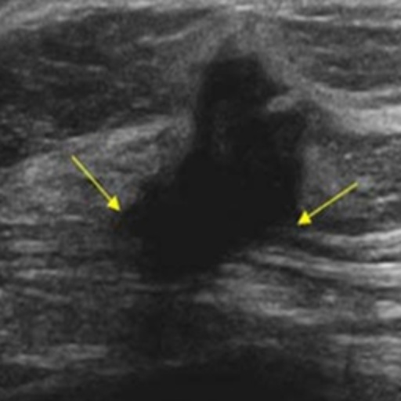

<h2>Tensorflow-Image-Segmentation-BUS-UC-Malignant (2025/05/14)</h2>
Sarah T. Arai 
Software Laboratory antillia.com  

This is the first experiment of Image Segmentation for BUS-UC-Malignant 
 based on 
the latest <a href="https://github.com/sarah-antillia/Tensorflow-Image-Segmentation-API">Tensorflow-Image-Segmentation-API</a>, and

a pre-augmented <a href="https://drive.google.com/file/d/14mP6Km_QKO_WKe2iGXgN_9nLMS_xtSmH/view?usp=sharing">
BUS-UC-Malignant-ImageMask-Dataset.zip</a>,
which was derived by us from 
<a href="https://data.mendeley.com/datasets/3ksd7w7jkx/1">
Mendeley Data: BUS_UC</a>
 
 
<b>Data Augmentation Strategy:</b> 
 To address the limited size of the BUS_UC,which contains 453 images and their corresponding masks in Malignant dataset, 
 we employed <a href="./generator/ImageMaskDatasetGenerator.py">an offline augmentation tool</a> to generate a 512x512 pixels pre-augmented dataset, which supports the following augmentation methods.
 
<li>Vertical flip</li>
<li>Horizontal flip</li>
<li>Rotation</li>
<li>Shrinks</li>
<li>Shears</li> 
<li>Deformation</li>
<li>Distortion</li>
<li>Barrel distortion</li>
<li>Pincushion distortion</li>
 
Please see also the following tools  
<li><a href="https://github.com/sarah-antillia/Image-Deformation-Tool">Image-Deformation-Tool</a></li>
<li><a href="https://github.com/sarah-antillia/Image-Distortion-Tool">Image-Distortion-Tool</a></li>
<li><a href="https://github.com/sarah-antillia/Barrel-Image-Distortion-Tool">Barrel-Image-Distortion-Tool</a></li>
 

<b>Actual Image Segmentation for Images of 512x512 pixels</b> 
As shown below, the inferred masks look similar to the ground truth masks.  

<table>
<tr>
<th>Input: image</th>
<th>Mask (ground_truth)</th>
<th>Prediction: inferred_mask</th>
</tr>
<tr>
<td></td>
<td></td>
<td></td>
</tr>

<tr>
<td></td>
<td></td>
<td></td>
</tr>

<tr>
<td></td>
<td></td>
<td></td>
</tr>

</table>

 
In this experiment, we used the simple UNet Model 
<a href="./src/TensorflowUNet.py">TensorflowSlightlyFlexibleUNet</a> for this BUS-UC-Malignant Segmentation Model. 
As shown in <a href="https://github.com/sarah-antillia/Tensorflow-Image-Segmentation-API">Tensorflow-Image-Segmentation-API</a>.
you may try other Tensorflow UNet Models: 

<li><a href="./src/TensorflowSwinUNet.py">TensorflowSwinUNet.py</a></li>
<li><a href="./src/TensorflowMultiResUNet.py">TensorflowMultiResUNet.py</a></li>
<li><a href="./src/TensorflowAttentionUNet.py">TensorflowAttentionUNet.py</a></li>
<li><a href="./src/TensorflowEfficientUNet.py">TensorflowEfficientUNet.py</a></li>
<li><a href="./src/TensorflowUNet3Plus.py">TensorflowUNet3Plus.py</a></li>
<li><a href="./src/TensorflowDeepLabV3Plus.py">TensorflowDeepLabV3Plus.py</a></li>

 

<h3>1. Dataset Citation</h3>
We used the following dataset in kaggle web site 
<a href="https://data.mendeley.com/datasets/3ksd7w7jkx/1">
Mendeley Data: BUS_UC</a>
  

<b>Description</b> 
The BUS_UC dataset includes 358 benign tumor images and 453 malignant tumor images. 
The resolution of Ultrasound images is 256 × 256 pixels. 
All these images were obtained from the website Ultrasound Cases (ultrasoundcases.info),
 which does not provide ground truth images. 
 Therefore, with the help of an experienced radiologist, benign and malignant tumor images are annotated 
 for segmentation and classification task.
 
 
<b>Citation </b> 
If you use this dataset, please cite : 

Ahmed Iqbal, Muhammad Sharif,  
"Memory-efficient transformer network with feature fusion for breast tumor segmentation and classification task
",  
Engineering Applications of Artificial Intelligence, 2023.  

<b>Institutions</b> 
COMSATS Institute of Information Technology - Wah Campus
  
<b>Categories</b> 
Breast Cancer, Image Segmentation, Ultrasound, Image Classification
  
<b>License</b> 
<a href="https://creativecommons.org/licenses/by/4.0/deed.en">
CC BY 4.0
</a>
 
<h3>
<a id="2">
2 BUS-UC-Malignant ImageMask Dataset
</a>
</h3>
 If you would like to train this BUS-UC-Malignant Segmentation model by yourself,
 please download the dataset from the google drive 
 <a href="https://drive.google.com/file/d/14mP6Km_QKO_WKe2iGXgN_9nLMS_xtSmH/view?usp=sharing">
 BUS-UC-Malignant-ImageMask-Dataset.zip
</a>, expand the downloaded and put it under <b>./dataset</b> folder as shown below.
 
<pre>
./dataset
└─BUS-UC-Malignant
    ├─test
    │   ├─images
    │   └─masks
    ├─train
    │   ├─images
    │   └─masks
    └─valid
        ├─images
        └─masks
</pre>
On the derivation of this datata, please refer to the following Python scripts: 
<li><a href="">ImageMaskDatasetGenerator.py</a></li>
<li><a href=",/generator/split_master.py">split_master</a></li>
 
<b>BUS-UC-Malignant Dataset Statistics</b> 
 
 
As shown above, the number of images of train and valid datasets is enough to use for a training set of our segmentation model.
 
 
<b>Train_images_sample</b> 

 
<b>Train_masks_sample</b> 

 

<h3>
3 Train TensorflowUNet Model
</h3>
 We have trained BUS-UC-MalignantTensorflowUNet Model by using the following
<a href="./projects/TensorflowSlightlyFlexibleUNet/BUS-UC-Malignant/train_eval_infer.config"> <b>train_eval_infer.config</b></a> file.  
Please move to ./projects/TensorflowSlightlyFlexibleUNet/BUS-UC-Malignant and run the following bat file. 
<pre>
>1.train.bat
</pre>
, which simply runs the following command. 
<pre>
>python ../../../src/TensorflowUNetTrainer.py ./train_eval_infer.config
</pre>

<b>Model parameters</b> 
Defined a small <b>base_filters</b> and large <b>base_kernels</b> for the first Conv Layer of Encoder Block of 
<a href="./src/TensorflowUNet.py">TensorflowUNet.py</a> 
and a large num_layers (including a bridge between Encoder and Decoder Blocks).
<pre>
[model]
base_filters   = 16
base_kernels   = (9,9)
num_layers     = 8
dilation       = (3,3)
</pre>

<b>Learning rate</b> 
Defined a small learning rate.  
<pre>
[model]
learning_rate  = 0.0001
</pre>

<b>Online augmentation</b> 
Disabled our online augmentation.  
<pre>
[model]
model         = "TensorflowUNet"
generator     = False
</pre>

<b>Loss and metrics functions</b> 
Specified "bce_dice_loss" and "dice_coef". 
<pre>
[model]
loss           = "bce_dice_loss"
metrics        = ["dice_coef"]
</pre>
<b>Learning rate reducer callback</b> 
Enabled learing_rate_reducer callback, and a small reducer_patience.
<pre> 
[train]
learning_rate_reducer = True
reducer_factor     = 0.4
reducer_patience   = 4
</pre>

<b>Early stopping callback</b> 
Enabled early stopping callback with patience parameter.
<pre>
[train]
patience      = 10
</pre>

<b>Epoch change inference callbacks</b> 
Enabled epoch_change_infer callback. 
<pre>
[train]
epoch_change_infer       = True
epoch_change_infer_dir   =  "./epoch_change_infer"
epoch_changeinfer        = False
epoch_changeinfer_dir    = "./epoch_changeinfer"
num_infer_images         = 6
</pre>

By using this callback, on every epoch_change, the inference procedure can be called
 for 6 images in <b>mini_test</b> folder. This will help you confirm how the predicted mask changes 
 at each epoch during your training process.    

<b>Epoch_change_inference output at start (epoch 1,2,3)</b> 
 
 
 
<b>Epoch_change_inference output at end (epoch 98,99,100)</b> 
 
 
 

In this experiment, the training process was terminated at epoch 100.  
 
 

<a href="./projects/TensorflowSlightlyFlexibleUNet/BUS-UC-Malignant/eval/train_metrics.csv">train_metrics.csv</a> 
 

 
<a href="./projects/TensorflowSlightlyFlexibleUNet/BUS-UC-Malignant/eval/train_losses.csv">train_losses.csv</a> 
 

 

<h3>
4 Evaluation
</h3>
Please move to a <b>./projects/TensorflowSlightlyFlexibleUNet/BUS-UC-Malignant</b> folder, 
and run the following bat file to evaluate TensorflowUNet model for BUS-UC-Malignant. 
<pre>
./2.evaluate.bat
</pre>
This bat file simply runs the following command.
<pre>
python ../../../src/TensorflowUNetEvaluator.py ./train_eval_infer_aug.config
</pre>

Evaluation console output: 

  Image-Segmentation-BUS-UC-Malignant

<a href="./projects/TensorflowSlightlyFlexibleUNet/BUS-UC-Malignant/evaluation.csv">evaluation.csv</a> 

The loss (bce_dice_loss) to this BUS-UC-Malignant/test was low, and dice_coef very high as shown below.
 
<pre>
loss,0.0372
dice_coef,0.9616</pre>
 

<h3>
5 Inference
</h3>
Please move to a <b>./projects/TensorflowSlightlyFlexibleUNet/BUS-UC-Malignant</b> folder 
,and run the following bat file to infer segmentation regions for images by the Trained-TensorflowUNet model for BUS-UC-Malignant. 
<pre>
./3.infer.bat
</pre>
This simply runs the following command.
<pre>
python ../../../src/TensorflowUNetInferencer.py ./train_eval_infer_aug.config
</pre>

<b>mini_test_images</b> 
 
<b>mini_test_mask(ground_truth)</b> 
 

<b>Inferred test masks</b> 
 
 

<b>Enlarged images and masks </b> 

<table>
<tr>
<th>Image</th>
<th>Mask (ground_truth)</th>
<th>Inferred-mask</th>
</tr>

<tr>
<td></td>
<td></td>
<td></td>
</tr>

<tr>
<td></td>
<td></td>
<td></td>
</tr>

<tr>
<td></td>
<td></td>
<td></td>
</tr

>
<tr>
<td></td>
<td></td>
<td></td>
</tr>
<tr>
<td></td>
<td></td>
<td></td>
</tr>
<tr>
<td></td>
<td></td>
<td></td>
</tr>
</table>

 

<h3>
References
</h3>
<b>1. BUS_UC - Breast Ultrasound Dataset</b> 
 
<a href="https://www.kaggle.com/datasets/orvile/bus-uc-breast-ultrasound/code">
https://www.kaggle.com/datasets/orvile/bus-uc-breast-ultrasound/code
</a>
 
 
